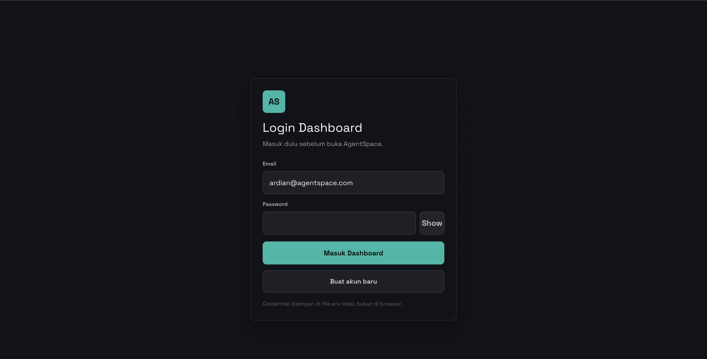
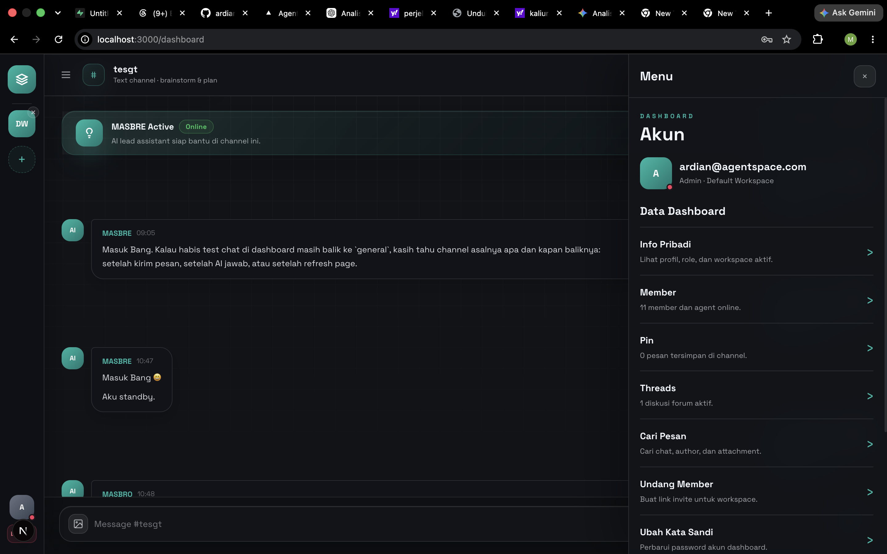

# AI AgentSpace Dashboard

Dashboard backend untuk mengelola workspace AI, channel diskusi, pesan, forum review, member workspace, dan pemanggilan agent melalui OpenClaw.

Project ini dibuat sebagai studi kasus backend dengan autentikasi, role access, relasi database, validasi request, dokumentasi API, dan beberapa fitur tambahan seperti attachment, search/filter, serta rate limiting login.

## Screenshot

### Login



### Dashboard



## Fitur

- Login, register, refresh session, dan logout.
- Session memakai access token dan refresh token di HTTP-only cookie.
- Role user: `admin`, `owner`, dan `member`.
- Admin dapat melihat user dan mengganti role.
- Workspace memiliki member, category, channel, message, forum post, dan forum reply.
- Channel mendukung tipe `text`, `forum`, dan `voice`.
- Message mendukung edit, pin, reaction, delete, search, filter, dan pagination.
- Attachment gambar memakai data URL dengan validasi mime, base64, dan ukuran maksimal.
- Agent dapat dipanggil dari dashboard dan balasannya disimpan ke riwayat pesan.
- Login dilindungi rate limiting untuk mengurangi brute force.
- Dokumentasi API tersedia melalui OpenAPI dan Postman Collection.

## Tech Stack

- Next.js 16 App Router
- React 19
- TypeScript
- Supabase
- Supabase Auth
- OpenClaw CLI
- bcryptjs
- JWT HTTP-only cookie

## Menjalankan Project

Install dependency:

```bash
npm install
```

Jalankan development server:

```bash
npm run dev
```

Buka aplikasi:

```text
http://localhost:3000
```

Dokumentasi OpenAPI:

```text
http://localhost:3000/api/docs/openapi
```

## Environment

konfigurasi:

```env
DASHBOARD_USERNAME=ardian
DASHBOARD_DISPLAY_NAME=Ardian
DASHBOARD_ROLE=admin
DASHBOARD_JWT_SECRET=your-jwt-secret
DASHBOARD_PASSWORD_HASH=your-bcrypt-password-hash
DASHBOARD_PASSWORD=your-demo-password

LOGIN_RATE_LIMIT_MAX_ATTEMPTS=5
LOGIN_RATE_LIMIT_WINDOW_SECONDS=60

NEXT_PUBLIC_SUPABASE_URL=your-supabase-url
NEXT_PUBLIC_SUPABASE_ANON_KEY=your-supabase-anon-key
SUPABASE_SERVICE_ROLE_KEY=your-supabase-service-role-key
AUTH_USER_STORE=supabase-auth

OPENCLAW_CLI_PATH=openclaw
OPENCLAW_PROFILE=masbre
OPENCLAW_AGENT_ID=main
OPENCLAW_SESSION_KEY=agent:main:dashboard
OPENCLAW_AGENT_RESPONSE_MODE=cli
```

```bash
node -e "const bcrypt=require('bcryptjs'); console.log(bcrypt.hashSync('password-demo', 12))"
```

## Struktur Database

Schema database untuk Supabase ada di:

```text
supabase/schema.sql
```

Entity utama:

- `auth.users`
- `workspaces`
- `workspace_members`
- `categories`
- `channels`
- `messages`
- `forum_posts`
- `forum_replies`

Relasi penting:

- Satu workspace memiliki banyak category dan channel.
- Satu workspace memiliki banyak member lewat `workspace_members`.
- Satu channel memiliki banyak message.
- Satu forum post memiliki banyak reply.

## Role & Akses

Role disimpan di Supabase Auth `user_metadata.role`.

- `admin`: akses penuh untuk pengelolaan user, role, dan endpoint admin.
- `owner`: pengelola workspace dan member workspace.
- `member`: user biasa yang memakai dashboard dan fitur chat.

Untuk menjadikan user sebagai admin lewat Supabase SQL Editor:

```sql
update auth.users
set raw_user_meta_data = coalesce(raw_user_meta_data, '{}'::jsonb)
  || '{"role":"admin"}'::jsonb
where email = 'ardian@agentspace.com';
```

Setelah role diubah, logout lalu login ulang.

## Endpoint Utama

Auth:

- `POST /api/auth/register`
- `POST /api/auth/login`
- `POST /api/auth/refresh`
- `POST /api/auth/logout`
- `GET /api/auth/me`

Dashboard:

- `GET /api/dashboard/data`
- `GET /api/config/status`

Workspace:

- `POST /api/categories`
- `POST /api/channels`
- `GET /api/workspace-members`
- `POST /api/workspace-members`
- `DELETE /api/workspace-members`

Messages:

- `GET /api/messages`
- `POST /api/messages`
- `PATCH /api/messages/:id`
- `DELETE /api/messages/:id`

Forum:

- `POST /api/forum-posts`
- `POST /api/forum-posts/:id/replies`

Agent:

- `POST /api/agents/invoke`

Admin:

- `GET /api/admin/users`
- `PATCH /api/admin/users`
- `POST /api/admin/cleanup`

Docs:

- `GET /api/docs/openapi`

## Keamanan

- Password user utama dikelola oleh Supabase Auth.
- Fallback admin lokal mendukung bcrypt 12 rounds.
- Access token dan refresh token disimpan sebagai HTTP-only cookie.
- Route dashboard dilindungi middleware.
- Endpoint privat membaca session dari cookie.
- Endpoint admin memeriksa role `admin`.
- Login memakai rate limiting per kombinasi IP dan email.
- Request payload divalidasi sebelum diproses.

Jika login gagal terlalu sering, API mengembalikan `429` beserta header `Retry-After`.

## Dokumentasi API

OpenAPI JSON tersedia di:

```text
GET /api/docs/openapi
```

Postman Collection tersedia di:

```text
docs/postman-collection.json
```

## Demo Flow

1. Register user baru atau login sebagai admin.
2. Buka dashboard.
3. Cek status konfigurasi.
4. Buat category dan channel.
5. Kirim pesan biasa atau pesan dengan attachment.
6. Coba search, filter, edit, pin, react, dan delete message.
7. Buat forum post dan reply.
8. Panggil agent dari dashboard.
9. Sebagai admin, buka panel konfigurasi dan ubah role user.
10. Buka `/api/docs/openapi` atau import Postman Collection untuk mencoba endpoint.

## Pengujian

Jalankan:

```bash
npm run test
```

Script tersebut menjalankan lint dan production build:

```bash
npm run lint
npm run build
```

## Penyimpanan Konfigurasi

- Konfigurasi lokal disimpan di file `.env`.
- Nilai pada README hanya contoh agar setup project lebih mudah diikuti.
- `OPENCLAW_AGENT_RESPONSE_MODE=cli` digunakan untuk menjalankan agent melalui OpenClaw.
- `OPENCLAW_AGENT_RESPONSE_MODE=fast` tersedia sebagai mode demo cepat.
